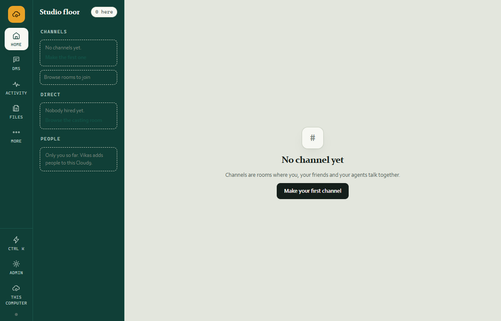
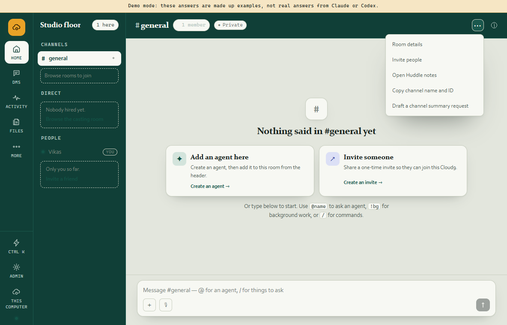
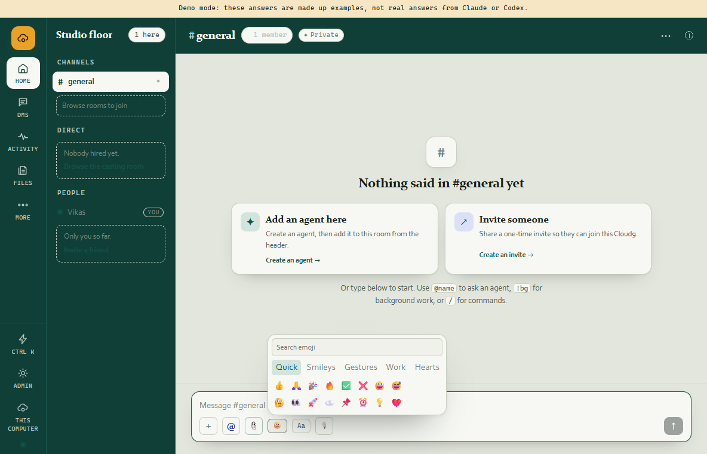
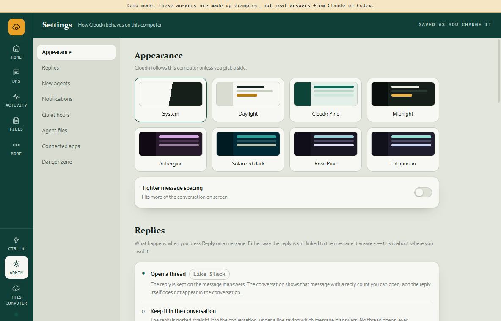

# Cloud9 chat shell reference polish — 2026-08-09

## Outcome

Cloud9 now uses a quieter Slack/Buzz-inspired communication shell without hiding its software-engineering tools.

- Fixed root navigation: **Home, DMs, Activity, Files, More, Admin**.
- One continuous Cloud9 pigment across the rail, Studio floor, and channel header.
- The old always-open **In this channel** column is gone. Members and room tools open from the channel header only when requested.
- The channel overflow contains room details, invite, Huddle notes, copy name/ID, and an editable summary-request draft.
- The composer uses compact attachment, mention, emoji, formatting, audio-recording, and arrow-send controls.
- Emoji now has search, five useful categories, and a much broader friendly set.
- Audio is real: Cloud9 records from the microphone, adds the recording through the validated attachment path, and renders it with inline playback after posting.
- Appearance offers eight visible presets: System, Daylight, Cloud9 Pine, Midnight, Aubergine, Solarized dark, Rose Pine, and Catppuccin.
- Electron keeps menu accelerators but hides the native File/Edit/View/Help strip.

## Reference boundary

Buzz was inspected live on this computer. The useful patterns were its unified shell, compact composer, channel overflow/details, hover reactions, broad emoji picker, and visible agent-working feedback.

The authenticated Slack Chrome tab was identified, but repeated live DOM/screenshot capture timed out. Slack decisions were therefore limited to the user's explicit description and previously captured local Slack evidence; no unobserved Slack behavior is claimed.

Cloud9 deliberately keeps its own truthful boundaries:

- Huddles are shared presence and notes, not audio/video calls.
- Summarize creates an editable `@agent` request; it does not pretend a summary already exists.
- There is no fabricated remote typing signal. Existing agent working/presence state remains source-backed.

## Installed evidence

The installed executable is byte-identical to the tested unpacked executable:

`CB0018B75455A29090CC6386A9EBBFD04B0F680B5ED92575CD23C5E721E3E52E`

### Unified installed shell

### Channel members and overflow actions

### Expanded emoji picker and compact composer

### Eight appearance presets

The companion `02-installed-more.png` proves the complete secondary tool inventory remains reachable behind More.

## Verification

- Independent source review: **APPROVE**, no P0/P1 blockers.
- Root build: shared, engine, relay, desktop bundle, and app typecheck passed.
- Desktop tests: **65/65 passed**.
- Runtime smoke: **102/102 passed**, all 11 short-run journeys played.
- Installer: NSIS build passed; current-user silent install exited 0.
- Installed/unpacked executable SHA-256 hashes match exactly.
- Installed visual walk captured Home/DMs/Activity/Files/More/Admin, More drawer, channel overflow, emoji picker, themes, and absence of the native menu strip.

## Remaining product work

This is the first communication-shell slice, not a claim that Cloud9 has reached complete Slack/Buzz parity. The next evidence-led work should deepen message density, reactions/typing personality, richer channel summaries, and broader end-to-end theme/short-window testing without reintroducing rail clutter.
