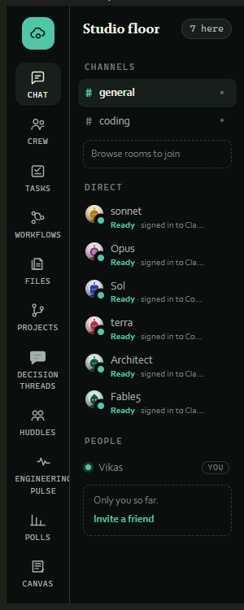
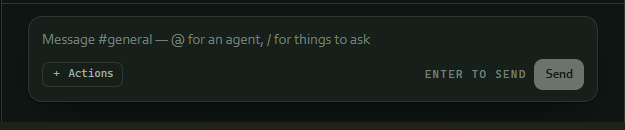
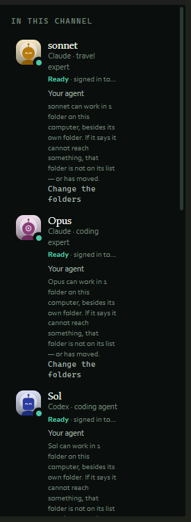
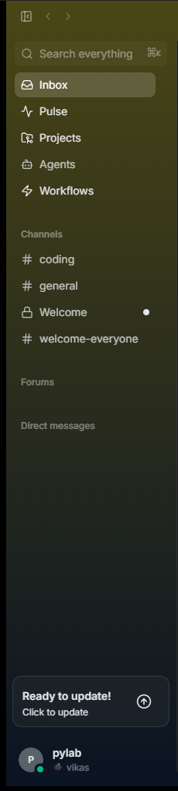
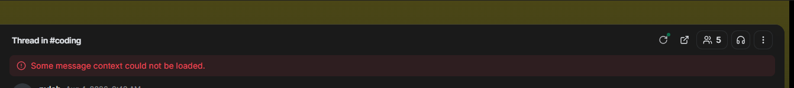
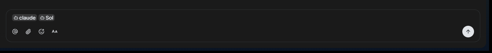
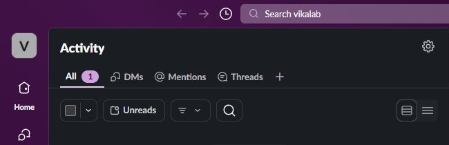
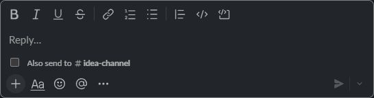

# Cloud9 vs Buzz vs Slack — frontend and chat experience handoff

**Prepared for:** t3 code
**Inspection date:** 9 August 2026 (Asia/Calcutta)
**Surfaces inspected:** installed Cloud9 desktop `0.1.0`, installed Buzz desktop `0.5.5`, authenticated Slack web app in Google Chrome

## Evidence boundary

This is a quick, runtime-observed product comparison. I opened the installed Cloud9 app, inspected the already-running Buzz app, and inspected the already-open Slack workspace in Chrome. No messages were sent, no settings were changed, and no product data was edited. Screenshots are deliberately cropped to product chrome, navigation, status, and composer controls so private conversation content is not included.

The comparison covers the visible desktop experience and the currently reachable state. It is not a complete feature certification, performance benchmark, accessibility conformance audit, or mobile/responsive review.

## Executive recommendation

The product direction for Cloud9 should be:

> **Slack-quality communication + Buzz-quality triage + Cloud9-native engineering orchestration.**

Cloud9 already has the strongest product breadth for an agentic engineering team. Its problem is not missing ambition; it is that the navigation, chat, agent presence, and specialist tools compete for attention at the same visual level. Buzz is calmer and easier to scan, while Slack is far more mature in chat composition, activity triage, thread handling, density controls, and interaction semantics.

Do **not** turn Cloud9 into a Slack clone. Keep Cloud9's engineering identity—agents, tasks, workflows, projects, decisions, huddles, pulse, polls, canvas—but reorganize it around a much clearer communication spine.

## Screenshot evidence

### Cloud9: broad engineering workspace

The installed Cloud9 build exposes the broadest specialist toolset directly in the primary rail. This is strategically strong but visually expensive: eleven top-level destinations, the room list, direct agents, and people compete in one narrow area.

The composer clearly communicates agent mentions and slash-style actions, but it presents fewer obvious authoring controls than Slack and less attachment/context affordance than Buzz.

Cloud9 makes agent availability and capability visible in-context. That is a genuine differentiator. The current long-form roster repeats status/capability copy and consumes substantial horizontal space.

### Buzz: focused inbox and thread workspace

Buzz presents fewer primary concepts, with Inbox as the default coordination surface. The hierarchy is calmer and easier to learn, though large unused areas and muted section labels reduce information efficiency.

Buzz keeps failures close to the affected thread, which is better than a detached global toast. The observed error states the problem but does not expose an obvious recovery action.

Buzz's composer is spacious and keeps agent context visible as chips. Attach, mention, emoji/agent action, and formatting controls are visible without overwhelming the surface.

### Slack: mature activity and composition model

Slack's Activity surface is the strongest triage model observed: All, DMs, Mentions, Threads, unread filtering, search, and detailed/dense layout controls are grouped into a clear two-level hierarchy.

Slack's composer communicates rich text, lists, links, code, attachments, emoji, mentions, thread-to-channel propagation, send, and scheduling. It is the most complete chat-authoring experience of the three.

## Comparison summary

| Dimension | Cloud9 | Buzz | Slack |
|---|---|---|---|
| Frontend character | Distinct engineering command center; dense and highly specialized | Calm, modern inbox-first desktop; clearer but less information-rich | Mature collaboration system with strong hierarchy and consistency |
| Navigation | Maximum feature discoverability, but too many equal-weight top-level items | Small primary nav plus channel hierarchy; easiest initial scan | Strong global rail and contextual secondary navigation |
| Chat model | Channels, direct agents, replies, room-specific agent roster, agent-aware actions | Inbox → thread detail, channels, forums, DMs, agent chips | Channels/DMs, side-thread workflow, Activity, rich composer, scheduling |
| Agent model | Best: agents are first-class participants with readiness and capability context | Strong: Agents and Workflows are primary concepts; agents appear in composer | Agents appear as apps/participants, but orchestration is not the product center |
| Work orchestration | Best breadth: tasks, workflows, projects, files, decisions, huddles, pulse, polls, canvas | Good core: projects, agents, workflows, pulse, forums | Strong collaboration integrations, but engineering workflow is integration-led |
| Triage | Fragmented across chat and specialist tools in the observed build | Inbox-first and immediately understandable | Best-in-class Activity filters, mentions, threads, unread controls, density |
| Visual density | High; right roster and left subnavigation compress the conversation | Low-to-medium; spacious but can feel empty | Medium-to-high, with user-controlled density in Activity |
| Error communication | Not exercised in this pass | Inline and visible, but weak recovery | Mature state patterns were visible structurally; failure paths were not exercised |
| Accessibility evidence | Desktop web content did not expose a useful automation tree in this pass; not assessed | Same limitation; not assessed | DOM exposed labelled tabs, toolbars, buttons, selected/pressed states, textbox and status semantics |
| Overall | Most differentiated product, least resolved information architecture | Best starting point for calm desktop triage | Best benchmark for communication quality and interaction maturity |

## Frontend perspective

### What Cloud9 should keep

- The unmistakable engineering-workspace identity.
- Persistent visibility of agents as collaborators, not merely integrations.
- Separate specialist surfaces for tasks, workflows, projects, decisions, huddles, pulse, polls, and canvas.
- The dark, technical visual language and compact operational density.
- Room-level context and a visible relationship between conversations and work artifacts.

### What should change

1. **Reduce primary navigation competition.** Chat, Inbox, Work, Agents, and More should be the first-level model. Specialist engineering tools belong inside Work or a configurable secondary rail.
2. **Make the right rail contextual and collapsible.** Show compact avatars/status by default; expand capability details on selection. Do not repeat long agent capability paragraphs for every member.
3. **Unify typography.** The current serif headings, monospaced labels, and sans-serif body styles create a distinctive but fragmented hierarchy. Use one product sans family plus monospace only for code, IDs, commands, and status data.
4. **Make density adjustable.** Borrow Slack's detailed/dense idea for inboxes, activity feeds, and long project lists.
5. **Use semantic color sparingly.** Keep mint for active/ready, amber for waiting, red for failure, blue/violet for agent/action provenance; avoid using accent color as decoration.

## Chat experience perspective

### Cloud9's opportunity

Cloud9's conversation surface should become the command layer for engineering work, not just another chat timeline.

Recommended composer model:

- rich text and markdown controls comparable to Slack;
- attachment and artifact linking comparable to Buzz;
- `@agent` routing and `/action` commands retained from Cloud9;
- an explicit **Delegate** action that opens task/agent/scope fields;
- **Send**, **Schedule**, and **Request approval** as distinct actions;
- visible delivery/pending/failure state attached to the submitted message;
- draft preservation across navigation, reconnect, refusal, and retry;
- thread replies in a side panel, with a clear “also post to channel” option;
- source chips for task, run, pull request, issue, artifact, project, and workflow links.

### Activity and inbox model

Cloud9 needs one consolidated inbox with tabs:

- **All**
- **Mentions**
- **Threads**
- **Agent updates**
- **Approvals**
- **Failures**

Controls should include unread-only, project/agent filters, search, bulk read/archive, and detailed/dense layouts. This is the single most valuable pattern to borrow from Slack and Buzz.

## Feature perspective

### Visible feature inventory in this pass

**Cloud9:** Chat, Crew, Tasks, Workflows, Files, Projects, Decision Threads, Huddles, Engineering Pulse, Polls, Canvas, channels, direct agents, room agent roster.

**Buzz:** Inbox, Pulse, Projects, Agents, Workflows, channels, Forums, Direct messages, threaded detail, agent-aware composer.

**Slack:** Home, DMs, Activity, Files, workspace switching, global search, Activity tabs for All/DMs/Mentions/Threads, unread filtering, search, density choice, threaded composer, rich formatting, attachment, emoji, mention, channel propagation, scheduled send.

### Product gap that matters most

Cloud9 has more engineering features than the other two observed products, but the user must mentally assemble the workflow across many destinations. The next phase should connect features rather than add more top-level icons.

Every message, task, run, decision, poll, canvas block, workflow, and artifact should share:

- a consistent source chip;
- a consistent open/jump action;
- a consistent pending/success/error lifecycle;
- a consistent unread/read model;
- a consistent activity event;
- permission-aware redaction;
- agent/human attribution;
- reconnect-safe state.

## Overall experience verdict

### Cloud9

**Verdict:** strongest product thesis, currently the heaviest experience.

Cloud9 feels like a purpose-built agentic engineering control room. That is the right strategic position. The present experience asks the user to understand too much structure at once, and the primary chat surface does not yet feel as effortless as the specialist toolset is ambitious.

### Buzz

**Verdict:** best reference for calm operational triage.

Buzz feels easier on first contact because Inbox, thread list, and thread detail form a familiar flow. It should influence Cloud9's information hierarchy and composer spacing, but not set Cloud9's product scope.

### Slack

**Verdict:** best reference for communication mechanics and interaction maturity.

Slack is the benchmark for activity triage, thread composition, keyboard/semantic structure, and density. Cloud9 should borrow these mechanics while keeping engineering artifacts and agents native rather than integration-only.

## Build brief for t3 code

### Target architecture

Use an adaptive three-pane shell:

1. **Primary rail:** Chat, Inbox, Work, Agents, More.
2. **Context list:** rooms/DMs, inbox items, work modules, agents, or search results.
3. **Main surface:** conversation or engineering artifact.
4. **Optional right inspector:** thread, agent details, project context, approvals, or activity—not a permanently expanded roster.

At narrower widths, collapse the inspector first, then the context list. Preserve the active surface and provide explicit back navigation.

### Priority order

#### P1 — foundational experience

1. Consolidated Inbox/Activity with Mentions, Threads, Agent updates, Approvals, Failures.
2. Unified three-pane shell and collapsible contextual inspector.
3. Rich agent-aware composer with attachments, formatting, scheduling, delegate, approval, and draft preservation.
4. Consistent pending/success/error/offline/retry states attached to the initiating action.
5. Target-aware source links that open the exact task, run, PR/issue, artifact, project, workflow, poll, or canvas item.
6. Keyboard-operable navigation, visible focus, labelled controls, semantic selected/expanded/busy states, and live status announcements.

#### P2 — coherence and efficiency

7. Configurable detailed/dense layouts for inbox and lists.
8. Compact agent roster with expandable capability detail.
9. One typography system and one semantic status-color system.
10. Command palette/global search across messages, people, agents, tasks, runs, projects, files, and workflows.
11. Saved/Later and Follow-up actions available from every message and activity row.
12. Consistent empty, loading, permission, deleted/tombstone, and reconnect states across all modules.

### Acceptance criteria

- A new user can identify Chat, Inbox, Work, and Agents within ten seconds.
- The primary rail does not expose more than five persistent first-level destinations.
- A user can start a message, delegate it to an agent, attach/link work, and see pending/success/failure without leaving the conversation.
- A thread opens without replacing the channel context and supports posting back to the channel.
- Inbox supports unread-only, search, filters, and detailed/dense layouts.
- Every engineering link opens the exact destination item, not only its containing screen.
- Drafts survive navigation, reconnect, refusal, and retry.
- The same action lifecycle vocabulary is used across chat and specialist modules.
- The right inspector can be collapsed and does not permanently reduce the main work area.
- Keyboard focus remains visible and ordered; async status is exposed semantically.
- At 320 CSS-pixel equivalent width, primary tasks remain reachable without loss of functionality.
- No screenshot or copied example data is shipped as placeholder product content.

## Final design direction

Build Cloud9 as an **engineering operating system whose default interface is conversation**:

- Slack supplies the communication quality bar.
- Buzz supplies the inbox/thread economy.
- Cloud9 supplies the differentiated agent-and-work orchestration model.

That combination is stronger than copying any one product directly.
