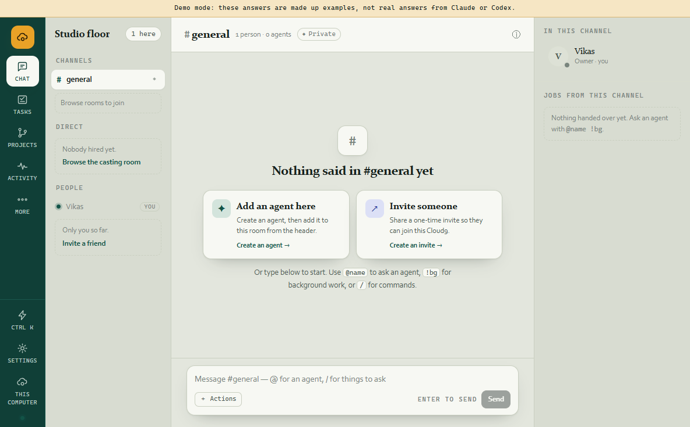
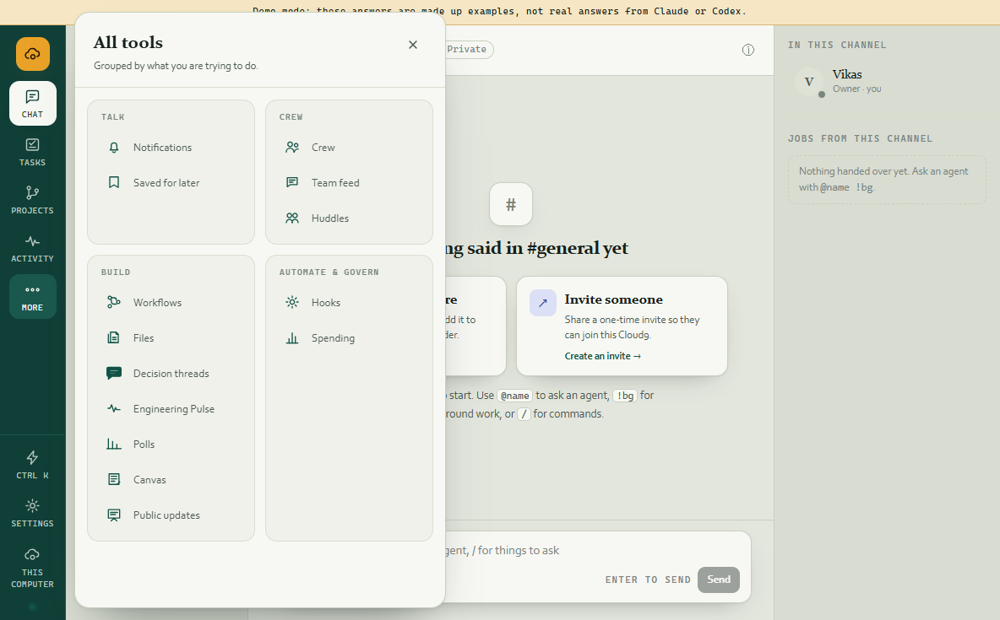

# Navigation and chat polish — packaged visual evidence

- Source: the `codex/navigation-chat-polish` tree immediately before this evidence file was recorded
- Date: 2026-08-09, Asia/Calcutta
- Runtime: `release/win-unpacked/Cloud9.exe`
- Profile: isolated temporary Electron profile
- Mode: `CLOUD9_DEMO=1`; no provider calls or user data

## Observed

- The permanent rail contains Chat, Tasks, Projects, Activity, and More.
- Settings remains visible in the fixed utility area at the bottom of the rail.
- More opens an accessible dialog grouped as Talk, Crew, Build, and Automate & govern.
- The packaged build displayed all 14 secondary destinations in the drawer.

## Screenshots

## Evidence boundary

This is an automated packaged-Electron visual walk using a fresh demo profile. It proves the rendered navigation hierarchy and drawer reachability. It is not a claim that every feature workflow was manually exercised, nor a comparison screenshot of Slack or Buzz.
